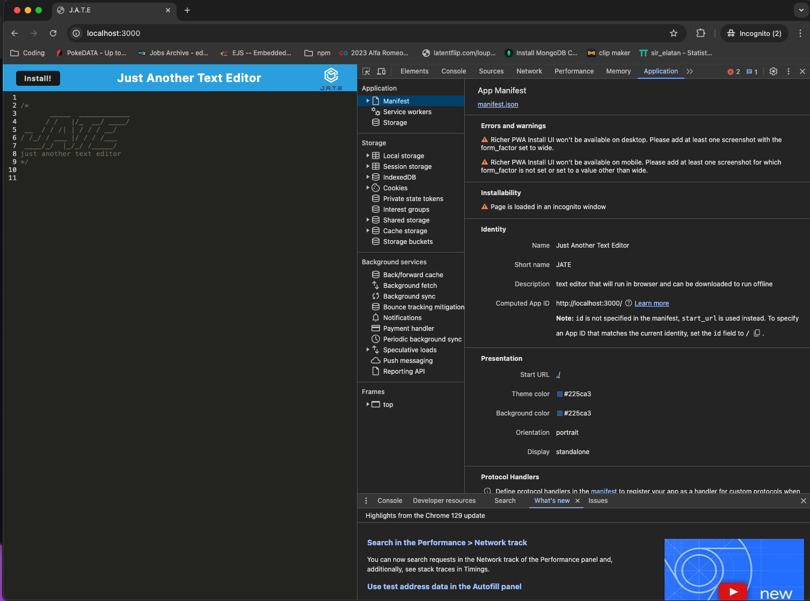
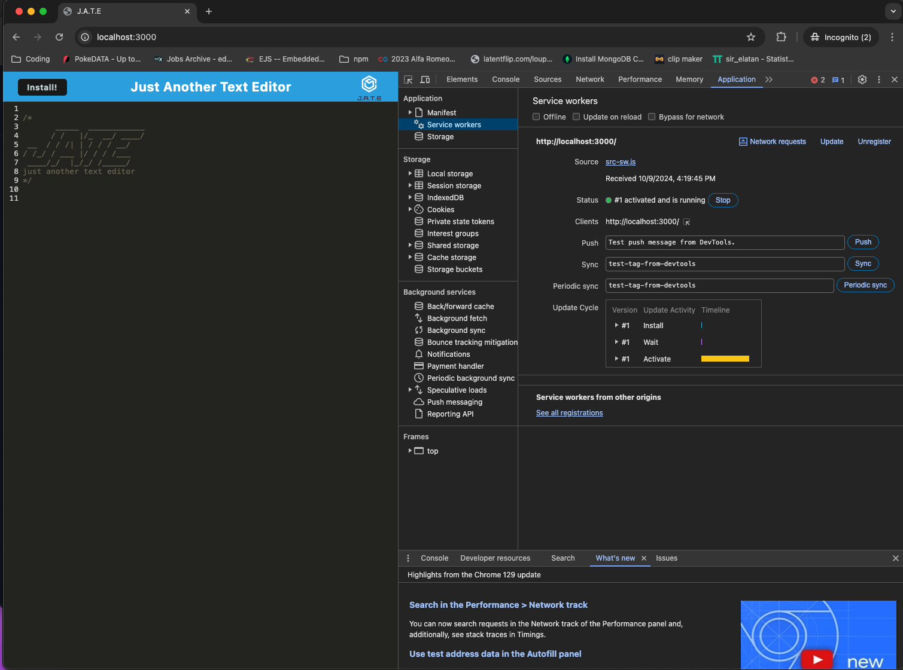
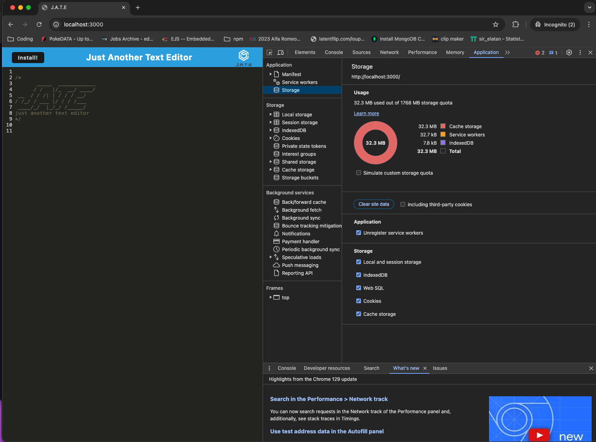
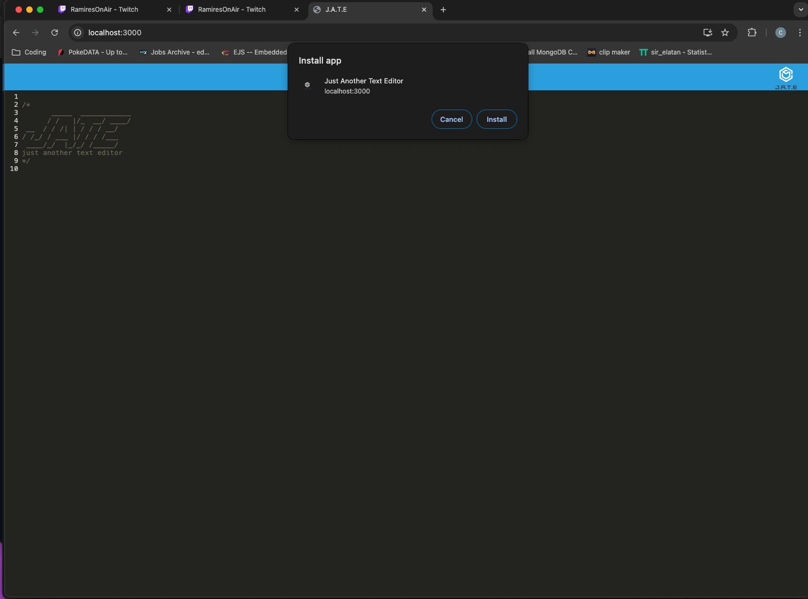
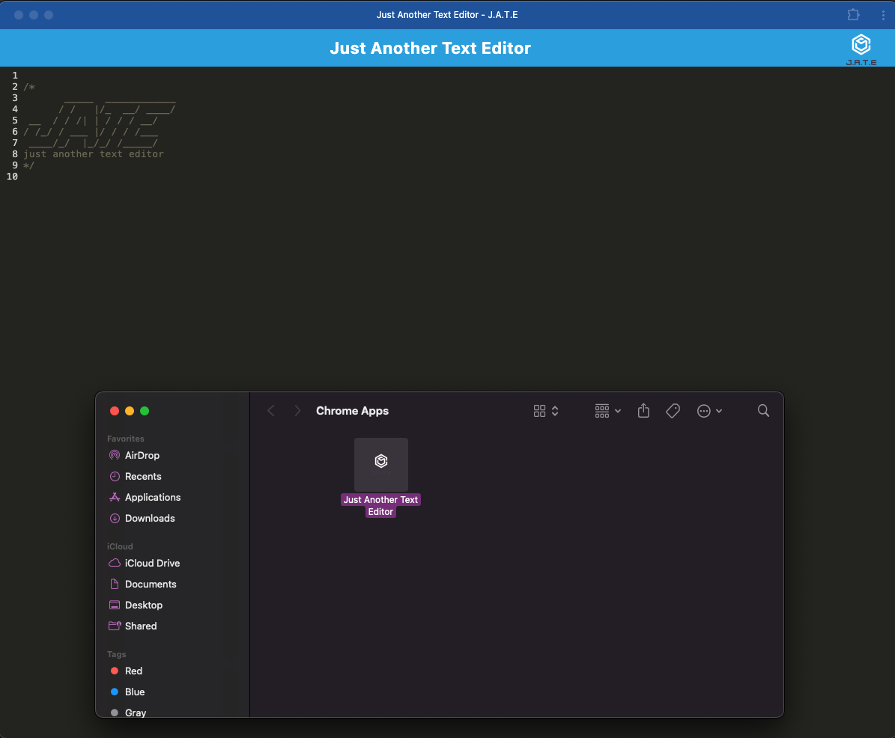
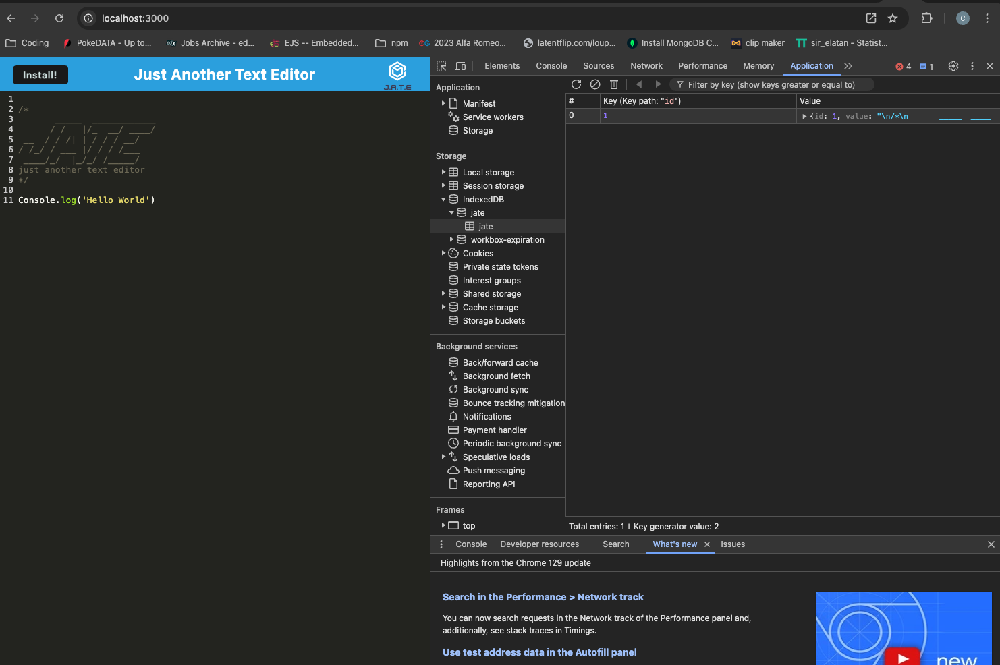

# progressive-web-applications-text-editor

# Description

This application a progressive web application(PWA) text editor that will in the browser, offline, and give the user the ability to download to their local machine. It enables the user to create and edit notes or code. 

# Technologies Used

- HTML
- CSS
- JavaScript
- Node.js
- Express.js
- Webpack
- Workbox
- babel
- regex

# Installation

- Clone this repo to your local machine
- once cd'd into the main folder run 'npm i' to install packages. 
- to start server, run 'npm start'

# Live Application

[Click here to view live application](https://progressive-web-applications-text-editor-w2ba.onrender.com)

# Screenshots of Application

## Contact

For questions about this application please reach out on Github or email.

- GitHub: [natale565](https://github.com/natale565)

- Email: [natale565@icloud.com](mailto:natale565@icloud.com)
